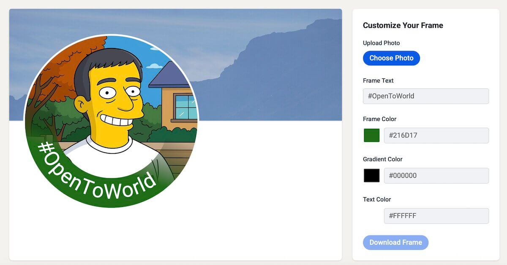

# Open-to-Work Style Photo Frame

A lightweight, client-side JavaScript web application that allows users to create custom photo frames with text overlays, similar to LinkedIn's "Open to Work" badge.

## Demo

Try the live demo [here](https://melnic.me/mini-apps/open-to/)



## Features

- **Image Upload**: Upload your own photo to create a custom frame
- **Custom Text**: Add personalized text overlays
- **Text Customization**:
  - Text color picker
  - Frame color picker
- **Live Preview**: Real-time canvas updates
- **Export**: Download final image as PNG
- **Privacy first**: All processing happens in your browser - no data is sent to servers

## Technologies Used

- **Vite**: Fast build tool and development server
- **Vanilla JavaScript**: No frameworks, pure client-side logic
- **Tailwind CSS**: Utility-first CSS framework for styling
- **HTML5 Canvas API**: For image rendering and text overlay
- **ESLint & Prettier**: Code quality and formatting

## Getting Started

### Prerequisites

- Node.js (version 24.3.0 or higher)
- npm

### Installation

1. Clone or download the project
2. Navigate to the project directory
3. Install dependencies:
   ```bash
   npm install
   ```

### Development

Start the development server:
```bash
npm run dev
```

The dev server opens at the configured base path (default `http://localhost:5173/`).

### Build for Production

```bash
npm run build
```

By default the app builds to the **site root** (`dist/index.html`, served at `/`).

### Deploying under a sub-route

The build is path-agnostic and configured via two environment variables (committed
defaults live in [`.env`](.env)):

| Variable    | Default               | Purpose |
|-------------|-----------------------|---------|
| `BASE_PATH` | `/`                   | Route the app is served from. Drives the Vite base, the output directory (`dist` mirrors this path), all in-app crosslinks, and the path portion of the SEO URLs / sitemap. |
| `SITE_URL`  | `https://example.com`   | Absolute origin used to build the SEO tags (canonical, `og:url`, `og:image`, JSON-LD) and `sitemap.xml`. |

Override them per build (CLI env wins over `.env`):

```bash
# Build for https://example.com/example/open-for/
BASE_PATH=/example/open-for/ SITE_URL=https://example.com npm run build
```

This emits a ready-to-mount tree at `dist/mini-apps/open-for/`:

```
dist/mini-apps/open-for/
├── index.html
├── privacy-policy/index.html
├── sitemap.xml          # generated, <loc>s match SITE_URL + BASE_PATH
├── og-image.jpg
└── assets/…
```

All assets, crosslinks, and SEO URLs resolve under the configured route — copy the folder
onto your server tree as-is.

## Usage

1. **Upload an Image**: Click "Choose File" to select an image from your device
2. **Enter Text**: Type your desired text in the text input field
3. **Customize Appearance**:
   - Select color with the color picker
4. **Preview**: See changes in real-time on the canvas
5. **Download**: Click "Download Frame" to save your creation as PNG

## Project Structure

Source lives under the `open-to/` directory (the Vite root). The output route and origin are
configurable at build time — see [Deploying under a sub-route](#deploying-under-a-sub-route).

## Browser Support

Works in all modern browsers that support:
- HTML5 Canvas
- ES6 Modules
- File API
- Download API

## License

This project is open source and available under the [MIT License](LICENSE).

## Acknowledgements

- Inspired by the classic "Open To" frame concept
- Built using help of AI 

## Contributing

Feel free to submit issues and enhancement requests!
